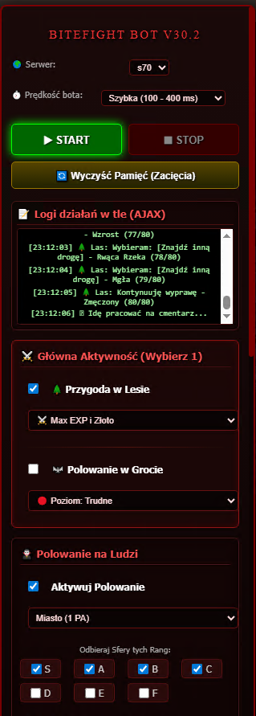
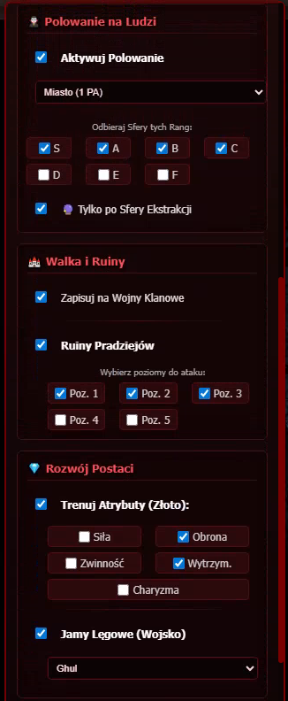
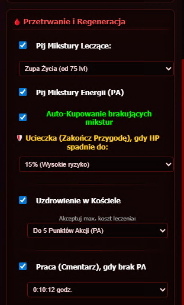

# 🦇 BiteFight Bot Pro v30.2 (AJAX Edition)

Zaawansowany, wysoce zoptymalizowany skrypt automatyzujący (Userscript) przeznaczony dla gry przeglądarkowej BiteFight. Projekt został stworzony z myślą o maksymalnej wydajności i dyskrecji. 

Dzięki pełnemu wdrożeniu asynchronicznych zapytań sieciowych (**AJAX / Fetch API**), bot operuje w 100% w tle. **Nie wymaga przeładowywania strony**, nie blokuje interfejsu gry i pozwala na swobodne przeglądanie innych zakładek, podczas gdy Twoja postać nieustannie się rozwija.

  

## 🌟 Główne Funkcje (Features)

### 💻 Nowoczesny Interfejs Użytkownika (GUI)
* **Panel Konfiguracyjny:** Elegancki, dopasowany do klimatu gry panel boczny, pozwalający na zarządzanie wszystkimi modułami bota w czasie rzeczywistym.
* **Konsola Logów (Live):** Zintegrowany podgląd działań bota. Śledź na bieżąco zdobywane Sfery, postęp w Lesie czy zakupy w Jamie Lęgowej, bez konieczności otwierania konsoli deweloperskiej.
* **Zabezpieczenia anty-blokadowe:** Konfigurowalne opóźnienia kliknięć (od trybu "Szybki" po "Bezpieczny/Ludzki"), zapobiegające wykryciu nienaturalnej aktywności przez serwer.

### ⚔️ Moduł Polowania i Przygód
* **Zaawansowane Sfery Ekstrakcji:** Inteligentny odbiór Sfer na podstawie wybranych rang (od S do F). Bot potrafi ominąć pętle przekierowań serwera (Status 303) i bezpiecznie deponować łupy w slotach.
* **Przygoda w Lesie z systemem logiki:** Rozpoznawanie aktualnego postępu misji (np. *90/120*). Konfigurowalne strategie wyborów (Max Exp/Złoto, Aspekty Natury, Zniszczenia, Wiedzy itp.). Bot inteligentnie dokończy aktywną przygodę przed zmianą zadania.
* **Grota i Polowanie na Ludzi:** Zautomatyzowane ataki z pełną obsługą Punktów Akcji (PA).

### 🏰 Wojna i Taktyka
* **Ruiny Pradziejów:** Precyzyjne uderzenia w wybrane piętra (1-5) z idealnie sformatowanym ładunkiem danych (payload), omijającym błędne komunikaty serwera.
* **Auto-Meldunek Klanowy:** Bot działa jako asystent wojenny, cyklicznie sprawdzając kwaterę główną (co 10 minut) i automatycznie dołączając do wojen klanowych.

### 💰 Zarządzanie Postacią i Ekonomia
* **Jamy Lęgowe (Wojsko):** Wykorzystanie natywnych instrukcji gry (jQuery $.ajax) do bezbłędnego zakupu wojska za krew, po 1 lub po 10 sztuk, omijając restrykcje nagłówków CSRF.
* **Rozwój Atrybutów:** Automatyczne inwestowanie nadmiaru złota w wybrane statystyki (Siła, Obrona, Zwinność itp.).
* **Inteligentny Cmentarz:** Gdy Punkty Akcji (PA) spadną poniżej ustalonego limitu, bot dokończy rozpoczęte misje i wyśle postać do pracy na wyznaczony czas, usypiając swoje procesy dla oszczędności zasobów (komputera/telefonu).
* **System Regeneracji:** Zautomatyzowane leczenie Kościołem (z limitem maksymalnego kosztu PA) oraz automatyczny zakup i spożywanie mikstur życia/energii z poziomu Rynku.

---

## ⚙️ Instalacja i Wymagania

Skrypt do poprawnego działania wymaga rozszerzenia obsługującego Userscripty.

1. Zainstaluj odpowiednie rozszerzenie dla swojej przeglądarki:
   * **Chrome / Edge / Opera / Kiwi Browser (Android):** [Tampermonkey](https://chrome.google.com/webstore/detail/tampermonkey/dhdgffkkebhmkfjojejmpbldmpobfkfo)
   * **Firefox:** [Tampermonkey](https://addons.mozilla.org/pl/firefox/addon/tampermonkey/)
2. Po zainstalowaniu rozszerzenia, przejdź do zakładki z kodem w tym repozytorium: `bitefight-bot-pro.user.js`
3. Kliknij przycisk **"Raw"** w prawym górnym rogu podglądu pliku.
4. Tampermonkey wykryje skrypt automatycznie – kliknij **Zainstaluj (Install)**.
5. Zaloguj się do gry BiteFight. Panel bota pojawi się w lewym rogu ekranu.

---

## 🛠️ Technologie
Projekt został napisany w "Vanilla JavaScript" (ES6+) z wykorzystaniem technologii Fetch API, DOMParser oraz selektywnego wykorzystania natywnych funkcji serwerowych gry (jQuery). Skrypt działa w architekturze *document-idle*, zapewniając pełną zgodność z interfejsem BiteFight.

---

## ⚖️ Nota prawna (Disclaimer)
> Skrypt został stworzony w celach edukacyjnych jako Proof of Concept (PoC) automatyzacji procesów w aplikacjach webowych. Wykorzystywanie oprogramowania automatyzującego ("botów") stanowi naruszenie Regulaminu Usług (Terms of Service) firmy Gameforge. Użytkownik korzysta ze skryptu wyłącznie na własną odpowiedzialność. Twórca nie ponosi odpowiedzialności za ewentualne blokady kont (bany) wynikające z użytkowania tego oprogramowania.
