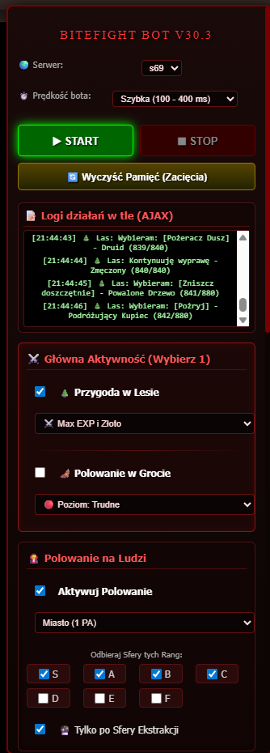
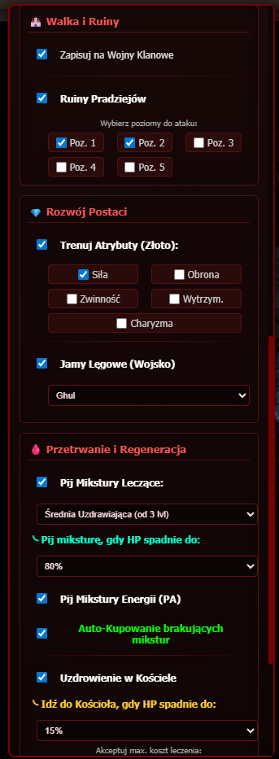
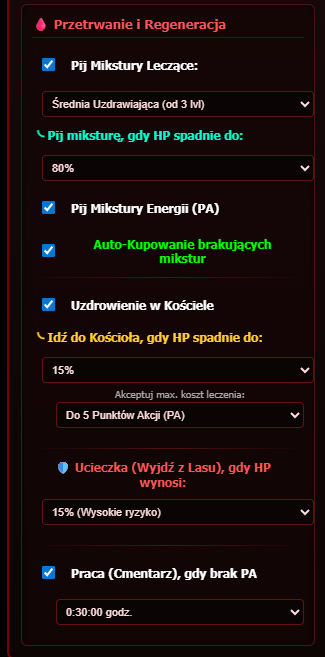

# 🦇 BiteFight Bot Pro v30.3 (AJAX Edition)

Zaawansowany, wysoce zoptymalizowany skrypt automatyzujący (Userscript) przeznaczony dla gry przeglądarkowej BiteFight. Projekt został stworzony z myślą o maksymalnej wydajności i dyskrecji. 

Dzięki pełnemu wdrożeniu asynchronicznych zapytań sieciowych (**AJAX / Fetch API**), bot operuje w 100% w tle. **Nie wymaga przeładowywania strony**, nie blokuje interfejsu gry i pozwala na swobodne przeglądanie innych zakładek, podczas gdy Twoja postać nieustannie się rozwija.

  

## 🌟 Główne Funkcje (Features)

### 💻 Nowoczesny Interfejs Użytkownika (GUI)
* **Panel Konfiguracyjny:** Elegancki, dopasowany do klimatu gry panel boczny, pozwalający na zarządzanie wszystkimi modułami bota w czasie rzeczywistym.
* **Konsola Logów (Live):** Zintegrowany podgląd działań bota. Śledź na bieżąco zdobywane Sfery, postęp w Lesie czy zakupy w Jamie Lęgowej, bez konieczności otwierania konsoli deweloperskiej.
* **Zabezpieczenia anty-blokadowe:** Konfigurowalne opóźnienia kliknięć (od trybu "Szybki" po "Bezpieczny/Ludzki"), zapobiegające wykryciu nienaturalnej aktywności przez serwer.

### 🩸 Przetrwanie i Dynamiczne Zdrowie
* **Precyzyjne progi leczenia:** W pełni konfigurowalne suwaki z poziomu GUI – sam decydujesz, przy ilu procentach HP bot pije mikstury, a kiedy udaje się do kapłana.
* **Inteligentny Kościół:** Algorytm odczytujący mnożniki prędkości serwera w czasie rzeczywistym, wyliczający dokładny czas odnowienia (cooldown) i pilnujący maksymalnego kosztu leczenia w PA.
* **Zarządzanie Energią (PA):** Automatyczne picie zwykłych Mikstur Energii (+10 PA) oraz **Eliksirów Energii Premium (+80 PA)**, gdy zapas punktów spadnie poniżej odpowiedniego poziomu.
* **Moduł Ucieczki:** Suwak "Ucieczki", który całkowicie zatrzymuje wyprawy (zabezpieczenie przed śmiercią postaci), gdy HP spadnie do niebezpiecznego poziomu.

### ⚔️ Moduł Polowania i Przygód
* **Zaawansowane Sfery Ekstrakcji:** Inteligentny odbiór Sfer na podstawie wybranych rang (od S do F). Bot potrafi ominąć pętle przekierowań serwera (Status 303) i bezpiecznie deponować łupy w wolnych slotach.
* **Przygoda w Lesie z systemem logiki:** Rozpoznawanie aktualnego postępu misji (np. *Zwłoki (90/120)*). Konfigurowalne strategie wyborów (Max Exp/Złoto, Aspekty Natury, Zniszczenia, Wiedzy itp.). Zawsze logicznie zamyka i dokańcza aktywne wyprawy.
* **Grota i Polowanie na Ludzi:** Zautomatyzowane ataki z pełną obsługą limitów Punktów Akcji (PA).

### 🏰 Wojna i Taktyka
* **Ruiny Pradziejów:** Precyzyjne uderzenia w wybrane piętra (1-5) z idealnie sformatowanym ładunkiem danych (payload) uwzględniającym tokeny CSRF.
* **Błyskawiczny Auto-Meldunek:** Bot działa jako asystent wojenny, cyklicznie sprawdzając kwaterę główną (co 10 minut) i automatycznie dołączając do wojen klanowych.

### 💰 Ekonomia i Rozwój Postaci
* **Smart Atrybuty (Najtańszy priorytet):** Bot czyta ceny zaznaczonych atrybutów i inwestuje złoto zawsze w ten **najtańszy**, zapewniając zrównoważony i optymalny rozwój postaci.
* **Jamy Lęgowe (Wojsko):** Wykorzystanie natywnych instrukcji gry (jQuery $.ajax) do bezbłędnego zakupu wojska za krew.
* **Inteligentny Cmentarz:** Gdy Punkty Akcji (PA) spadną do określonego progu, bot kulturalnie doprowadzi trwającą przygodę do końca i wyśle postać do pracy na wyznaczony czas, usypiając swoje procesy dla oszczędności zasobów (komputera/VPS/telefonu).

---

## ⚙️ Instalacja i Wymagania

Skrypt do poprawnego działania wymaga rozszerzenia obsługującego Userscripty.

1. Zainstaluj odpowiednie rozszerzenie dla swojej przeglądarki:
   * **Chrome / Edge / Opera / Kiwi Browser (Android):** [Tampermonkey](https://chrome.google.com/webstore/detail/tampermonkey/dhdgffkkebhmkfjojejmpbldmpobfkfo)
   * **Firefox:** [Tampermonkey](https://addons.mozilla.org/pl/firefox/addon/tampermonkey/)
2. Po zainstalowaniu rozszerzenia, przejdź do pliku z kodem w tym repozytorium: `bitefight-bot-pro.user.js`
3. Kliknij przycisk **"Raw"** w prawym górnym rogu podglądu pliku.
4. Tampermonkey wykryje skrypt automatycznie – kliknij **Zainstaluj (Install)**.
5. Zaloguj się do gry BiteFight. Panel bota pojawi się w lewym rogu ekranu.

---

## 🛠️ Technologie
Projekt został napisany w Vanilla JavaScript (ES6+) z wykorzystaniem technologii Fetch API, DOMParser oraz selektywnego wykorzystania natywnych funkcji serwerowych gry (jQuery). Skrypt działa w architekturze *document-idle*, zapewniając pełną zgodność z interfejsem gry i zerowe zużycie zbędnego transferu.

---

## ⚖️ Nota prawna (Disclaimer)
> Skrypt został stworzony w celach edukacyjnych jako Proof of Concept (PoC) automatyzacji procesów w aplikacjach webowych. Wykorzystywanie oprogramowania automatyzującego ("botów") może stanowić naruszenie Regulaminu Usług (Terms of Service) firmy Gameforge. Użytkownik korzysta ze skryptu wyłącznie na własną odpowiedzialność. Twórca nie ponosi odpowiedzialności za ewentualne blokady kont (bany) wynikające z użytkowania tego oprogramowania.
